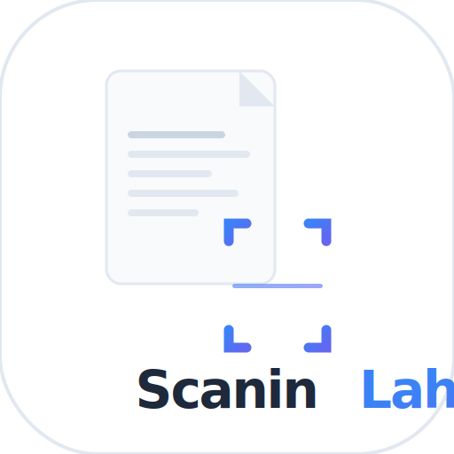

<div align="center">



# Scanin Lah

### Asisten Dokumen Pintar berbasis AI

[](https://react.dev)
[](https://typescriptlang.org)
[](https://tailwindcss.com)
[](https://capacitorjs.com)
[](LICENSE)

**Scan · Edit · Konversi · Tanya AI**

[📱 Demo](#demo) · [🚀 Fitur](#fitur) · [🛠️ Build APK](#build-apk) · [👨‍💻 Developer](#developer)

</div>

---

## 📱 Preview

<div align="center">
<table>
<tr>
<td align="center"><br/><sub><b>Login</b></sub></td>
<td align="center"><br/><sub><b>Home</b></sub></td>
<td align="center"><br/><sub><b>Dokumen</b></sub></td>
<td align="center"><br/><sub><b>Profil</b></sub></td>
</tr>
</table>
</div>

---

## ✨ Fitur

<table>
<tr>
<td width="50%">

### 📷 Scan Cerdas
- Kamera live dengan **AI edge detection**
- Auto-deteksi tepi dokumen (OpenCV.js + jscanify)
- Crop perspektif otomatis & manual
- **Multi-scan** — gabung banyak halaman jadi 1 PDF
- Atur urutan halaman sebelum simpan
- Simpan sebagai PDF, JPG, atau PNG

</td>
<td width="50%">

### ✏️ Edit Lengkap
- **OCR** — ekstrak teks dari gambar (Tesseract.js)
- Markup & sorot teks penting
- Sensor / redaksi konten
- Pisah dokumen jadi 2 bagian
- Gabung beberapa dokumen
- Cari & ganti teks

</td>
</tr>
<tr>
<td width="50%">

### 🔄 Konversi Format
- **PDF** — via jsPDF (embed gambar / teks)
- **DOCX** — Office Open XML valid
- **TXT** — plain text
- **JPG / PNG** — re-encode dengan kualitas tinggi
- Download langsung ke perangkat

</td>
<td width="50%">

### 🤖 Tanya AI
- Analisa isi dokumen secara mendalam
- Ringkasan otomatis
- Cari kata/frasa di semua dokumen
- Bandingkan 2 dokumen (similarity score)
- Voice input Bahasa Indonesia
- Semua respons dalam Bahasa Indonesia

</td>
</tr>
</table>

---

## 🛠️ Teknologi

<div align="center">

| Teknologi | Versi | Fungsi |
|:---:|:---:|:---|
|  | 19 | UI Framework |
|  | 5.9 | Type Safety |
|  | v4 | Styling |
|  | 7 | Build Tool |
| 🔬 OpenCV.js + jscanify | 4.8 | Edge Detection & Perspective |
| 🔤 Tesseract.js | latest | OCR Engine (ID + EN) |
| 📄 jsPDF | 2.5 | PDF Generation |
| ⚡ Capacitor | 7 | Native Android Wrapper |

</div>

---

## 🚀 Build APK

### Prasyarat

```
✅ Node.js 18+
✅ Android Studio (Hedgehog atau lebih baru)
✅ Java JDK 17+
✅ Android SDK (API 34+)
```

### Langkah-langkah

```bash
# 1. Clone & install
git clone https://github.com/ihyaabrar/scannin-lah.git
cd scannin-lah
npm install

# 2. Build web app
npm run build

# 3. Tambah platform Android (sekali saja)
npx cap add android

# 4. Sync ke Capacitor
npx cap sync android

# 5. Buka di Android Studio
npx cap open android
```

**Di Android Studio:**
1. Tunggu Gradle sync selesai (~5 menit pertama kali)
2. Pilih menu **Build → Generate Signed APK**
3. Pilih **APK** → buat keystore baru → simpan file `.jks`
4. Pilih **release** → Finish
5. APK tersedia di `android/app/release/app-release.apk`

> 💡 Transfer APK ke Redmi via USB/WhatsApp, lalu aktifkan **"Install dari sumber tidak dikenal"** di Settings → Privacy

### Development

```bash
npm run dev          # Dev server → http://localhost:5173
npm run build        # Production build
npm run cap:sync     # Build + sync Capacitor
npm run cap:android  # Build + sync + buka Android Studio
```

---

## 📁 Struktur Proyek

```
scanin-lah/
├── src/
│   ├── pages/          # Halaman utama (Scan, Edit, Convert, AI, dll)
│   ├── components/     # Komponen reusable (BottomNav, Toast, dll)
│   ├── hooks/          # Custom hooks (Android back, haptic)
│   ├── services/       # OCR service (Tesseract.js)
│   ├── store.ts        # Global state + localStorage
│   └── types.ts        # TypeScript types
├── public/
│   ├── logo.svg        # App icon
│   ├── manifest.json   # PWA manifest
│   └── sw.js           # Service worker (offline)
├── capacitor.config.ts # Konfigurasi Capacitor
└── vite.config.ts      # Konfigurasi Vite
```

---

## 👨‍💻 Developer

<div align="center">


**Ihya' Nashirudin Abrar**

[](https://github.com/ihyaabrar)
[](mailto:ihyakpati1144@gmail.com)

</div>

---

## 📄 Lisensi

```
MIT License © 2025 Ihya' Nashirudin Abrar

Bebas digunakan, dimodifikasi, dan didistribusikan
dengan tetap mencantumkan kredit kepada pengembang asli.
```

---

<div align="center">

Dibuat dengan ❤️ oleh **Ihya' Nashirudin Abrar**

⭐ Jika project ini bermanfaat, berikan bintang di GitHub!

</div>
